# Gate Agent Flow Schematic

## Overview

This document provides a visual schematic of the Gate Agent flow, showing how user input is processed through direct category matching, LLM extraction, state management, and button generation.

## Flow Diagram

```mermaid
flowchart TD
    Start([User Sends Message]) --> LoadState[Load Gate State & Config]
    LoadState --> CheckConfirmation{Is Awaiting<br/>Confirmation?}
    
    CheckConfirmation -->|Yes| CheckUserAction{User Action?}
    CheckUserAction -->|Confirm| MarkComplete[Mark Gates Complete<br/>pass_=True]
    CheckUserAction -->|Edit| ResetState[Reset pass_=False<br/>Allow Editing]
    CheckUserAction -->|Other| ContinueEdit[Continue with<br/>Gate Execution]
    
    CheckConfirmation -->|No| GetCurrentGate[Get Current Gate<br/>from previous_state]
    GetCurrentGate --> CheckDirectMatch{User Input Matches<br/>Expected Category?}
    
    CheckDirectMatch -->|Yes| DirectMatchPath[Direct Match Path]
    DirectMatchPath --> SetGateValue[Set Gate Value Directly<br/>classified=matched_category<br/>confidence=1.0]
    SetGateValue --> SelectNextGate1[GateSelector.select_next<br/>Deterministic Selection]
    SelectNextGate1 --> CheckCompletion1[GateCompletionChecker.check]
    CheckCompletion1 --> BuildResult1[Build ConsultantResult]
    BuildResult1 --> SaveState1[Save State to DB]
    SaveState1 --> CheckLimiting1{Has Limiting<br/>Value?}
    
    CheckDirectMatch -->|No| LLMPath[LLM Extraction Path]
    LLMPath --> BuildPrompt[GatePromptBuilder<br/>Build Extraction Prompt]
    BuildPrompt --> CallLLM[GateLLMService<br/>Extract Gate Values]
    CallLLM --> ParseResponse[GateJsonParser<br/>Parse LLM Response]
    ParseResponse --> ParseOK{Parse<br/>Successful?}
    
    ParseOK -->|No| ErrorResult[Return Error Result]
    ParseOK -->|Yes| MergeState[GateStateMerger<br/>Merge with Previous State]
    MergeState --> SelectNextGate2[GateSelector.select_next<br/>Hybrid: LLM + Deterministic]
    SelectNextGate2 --> CheckCompletion2[GateCompletionChecker.check]
    CheckCompletion2 --> BuildResult2[Build ConsultantResult]
    BuildResult2 --> SaveState2{State Already<br/>Saved?}
    
    SaveState2 -->|No| SaveState3[Save State to DB<br/>if not pass_]
    SaveState2 -->|Yes| SkipSave[Skip Save]
    SaveState3 --> CheckLimiting2{Has Limiting<br/>Value?}
    SkipSave --> CheckLimiting2
    
    CheckLimiting1 -->|Yes| StopWorkflow[Create Stop State<br/>Return Stop Message]
    CheckLimiting1 -->|No| CheckComplete1{Gates<br/>Complete?}
    CheckLimiting2 -->|Yes| StopWorkflow
    CheckLimiting2 -->|No| CheckComplete2{Gates<br/>Complete?}
    
    CheckComplete1 -->|Yes| BuildConfirmation[Build Confirmation Summary<br/>Show All Answers]
    CheckComplete1 -->|No| BuildNextGateButtons[Build Buttons for<br/>Next Gate]
    CheckComplete2 -->|Yes| BuildConfirmation
    CheckComplete2 -->|No| BuildNextGateButtons
    
    BuildConfirmation --> EmitArtifacts1[Emit PROBLEM_STATEMENT<br/>Emit DRAFT_PLAN]
    EmitArtifacts1 --> BuildConfirmButtons[Build Confirmation Buttons<br/>Confirm & Proceed<br/>Edit Answers]
    BuildConfirmButtons --> SavePendingState[Save State with<br/>pass_=False<br/>Awaiting Confirmation]
    
    BuildNextGateButtons --> FormatResponse[Format Gate Response<br/>Get Question Text]
    FormatResponse --> ReturnResult[Return Result to Orchestrator<br/>raw_message<br/>buttons<br/>button_context<br/>button_metadata<br/>completion_status<br/>gate_state]
    
    BuildConfirmButtons --> ReturnResult
    StopWorkflow --> ReturnResult
    MarkComplete --> HandoffPlanner[Handoff to Planner<br/>Emit HANDOFF Artifact]
    ResetState --> ContinueEdit
    ContinueEdit --> GetCurrentGate
    ErrorResult --> ReturnResult
    
    ReturnResult --> End([Orchestrator Formats<br/>& Emits to UI])
    HandoffPlanner --> End
```



## Key Components

### 1. Entry Point: `append_message()` in `nexus/modules/shaping_manager.py`

- Loads gate state and config from database
- Handles button click detection (original_value vs content)
- Routes to confirmation handling or gate execution

### 2. Direct Match Path (Lines 1045-1133)

- **Trigger**: User input exactly matches an expected category (case-insensitive)
- **Process**:
  - Sets gate value directly with `confidence=1.0`
  - Uses `GateSelector` for deterministic next gate selection
  - Uses `GateCompletionChecker` for completion status
  - Saves state immediately
- **Benefit**: No LLM call needed, faster, more reliable for button clicks

### 3. LLM Extraction Path (Lines 1136-1145)

- **Trigger**: No direct match found
- **Process**:
  - `GatePromptBuilder` builds extraction prompt
  - `GateLLMService` calls LLM
  - `GateJsonParser` parses response
  - `GateStateMerger` merges with previous state
  - `GateSelector` selects next gate (hybrid: LLM recommendation + deterministic)
  - `GateCompletionChecker` checks completion

### 4. Limiting Values Check (Lines 1147-1210)

- Checks if any gate has a `limiting_value` (e.g., "No", "Unknown" for gate 1)
- If found, creates stop state and returns stop message
- Workflow stops immediately

### 5. State Management

- **Save Points**:
  - After direct match (line 1130)
  - After LLM extraction if not already saved (line 1215)
  - When gates complete, save with `pass_=False` awaiting confirmation (line 1382)
  - When user confirms, save with `pass_=True` (line 862)

### 6. Button Building

- **Next Gate Buttons** (Lines 1389-1401): Built when gates not complete
  - Uses `_build_gate_buttons_from_config()`
  - Creates buttons for each expected category
  - Includes "Other" button if configured
- **Confirmation Buttons** (Lines 1345-1358): Built when gates complete
  - Uses `_build_confirmation_buttons_from_config()`
  - "Confirm & Proceed" and "Edit Answers" buttons

### 7. Response Formatting

- Formats gate response with question text
- Builds confirmation summary if gates complete
- Emits artifacts (PROBLEM_STATEMENT, DRAFT_PLAN)
- Returns structured result to orchestrator

## Data Flow

```
User Input
  ↓
ShapingManager.append_message()
  ↓
[Direct Match?] → Yes → Set Value → Select Next → Save State
  ↓ No
GateEngine.execute_gate()
  ↓
[Build Prompt] → [Call LLM] → [Parse] → [Merge State] → [Select Next] → [Check Completion]
  ↓
[Check Limiting Values] → Stop if found
  ↓
[Gates Complete?] → Yes → Build Confirmation
  ↓ No
Build Next Gate Buttons
  ↓
Return to Orchestrator
  ↓
Format & Emit to UI
```

## Key Files

- **Main Entry**: `nexus/modules/shaping_manager.py` - `append_message()` method
- **Gate Engine**: `nexus/brains/gate_engine.py` - `execute_gate()` method
- **Gate Selector**: `nexus/engines/gate/gate_selector.py`
- **State Merger**: `nexus/engines/gate/state_merger.py`
- **Completion Checker**: `nexus/engines/gate/completion_checker.py`
- **Prompt Builder**: `nexus/services/gate/prompt_builder.py`
- **LLM Service**: `nexus/services/gate/llm_service.py`
- **Orchestrator**: `nexus/conductors/workflows/orchestrator.py` - Handles formatting and emission


